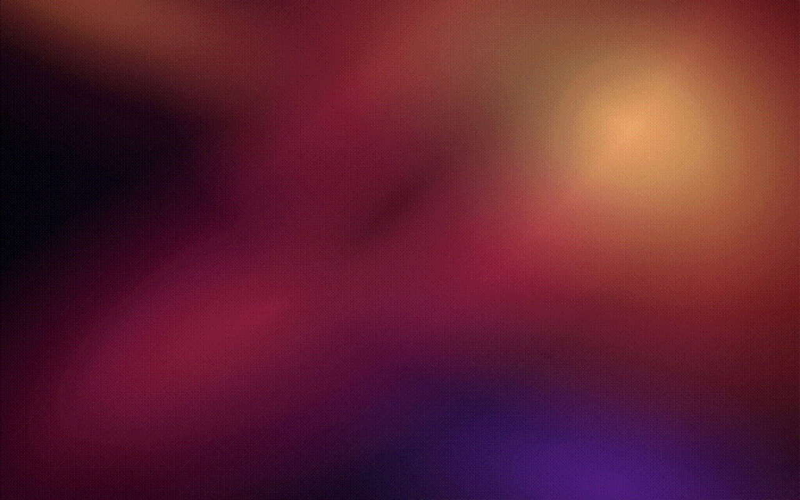
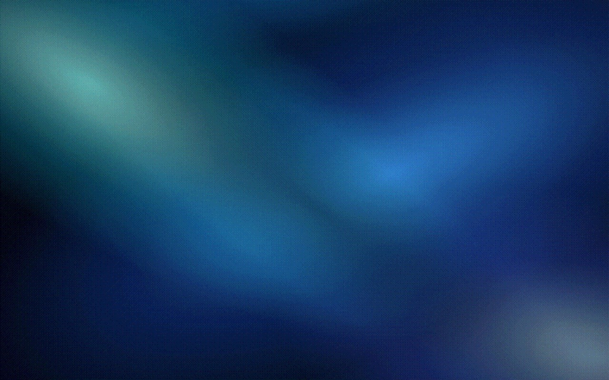
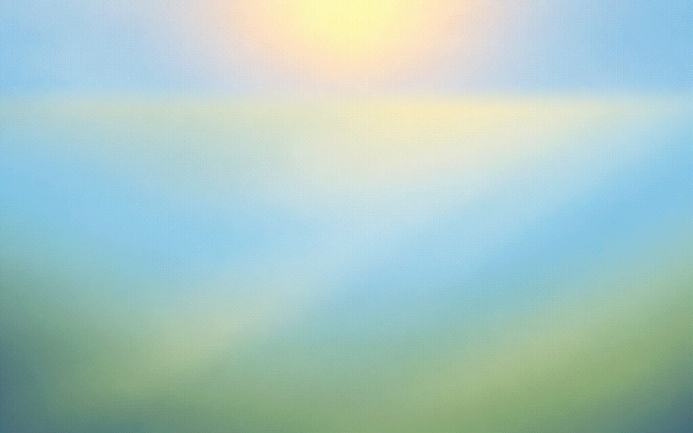
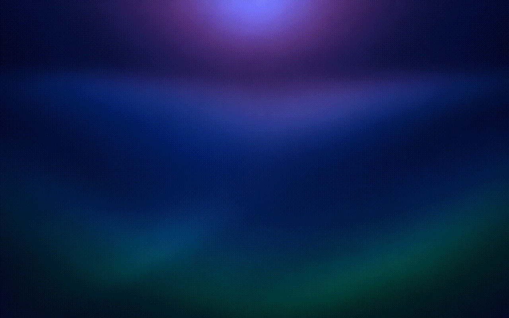
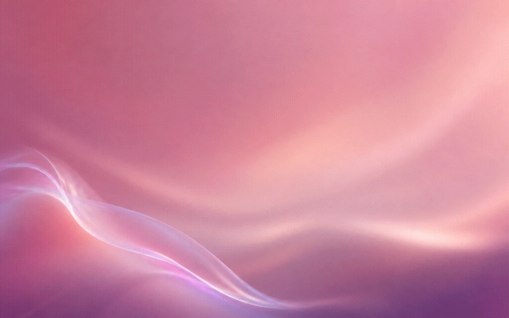
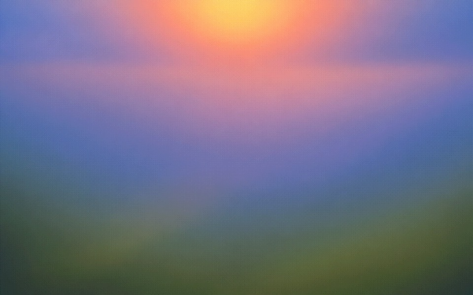
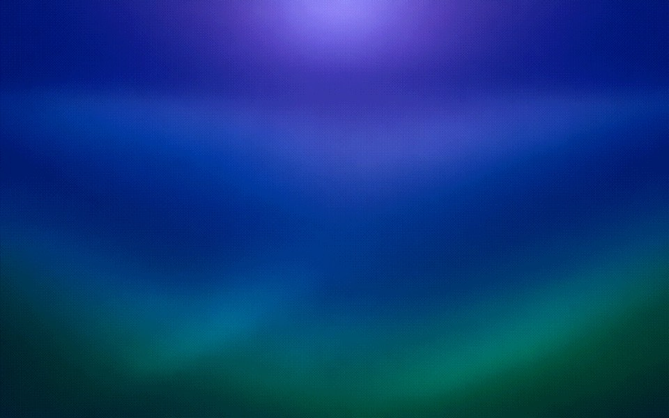
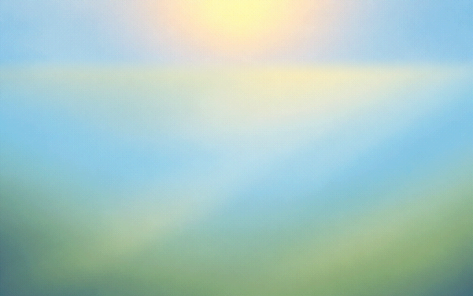

# Dither Wallpapers

**A collection of 12 still and 2 dynamic dither wallpapers in 5K.**

12 stills&nbsp;&nbsp;&nbsp;2 dynamic&nbsp;&nbsp;&nbsp;5120 × 3200&nbsp;&nbsp;&nbsp;16:10

## Still collection

Every still wallpaper is available individually in [`dither-wallpapers`](./dither-wallpapers) at full 5K resolution. Click any preview to open the original image.

<table>
  <tr>
    <td width="50%" valign="top">
      
      <h3>01 Solar Drift</h3>
      
Smouldering burgundy and amber gradients gathered around a restrained solar glow.

    </td>
    <td width="50%" valign="top">
      
      <h3>02 Ion Haze</h3>
      
Electric blue and cool cyan light diffused through deep midnight tones.

    </td>
  </tr>
  <tr>
    <td width="50%" valign="top">
      
      <h3>03 Polar Night</h3>
      
A quiet polar-blue night with a soft, suspended wash of cold light.

    </td>
    <td width="50%" valign="top">
      
      <h3>04 Polar Bloom</h3>
      
An airy field of ice blue, pale lavender and softly blooming daylight.

    </td>
  </tr>
  <tr>
    <td width="50%" valign="top">
      
      <h3>05 Amber Veil</h3>
      
Molten amber refraction folding through a rich red and near-black atmosphere.

    </td>
    <td width="50%" valign="top">
      
      <h3>06 Prism Current</h3>
      
A sapphire current traced by cool, luminous and subtly iridescent refraction.

    </td>
  </tr>
  <tr>
    <td width="50%" valign="top">
      
      <h3>07 Opal Fold</h3>
      
A translucent opal veil carrying cyan, lilac and warm pearl highlights.

    </td>
    <td width="50%" valign="top">
      
      <h3>08 Polar Meadow</h3>
      
Open sky blues, quiet meadow greens and a compact wash of morning sun.

    </td>
  </tr>
  <tr>
    <td width="50%" valign="top">
      
      <h3>09 Polar Meadow Night</h3>
      
The nocturnal counterpart: indigo light, violet bloom and deep pine green.

    </td>
    <td width="50%" valign="top">
      
      <h3>10 Rose Refraction</h3>
      
Dusty rose and raspberry gradients crossed by a barely-there pearlescent ribbon.

    </td>
  </tr>
  <tr>
    <td width="50%" valign="top">
      
      <h3>11 Polar Meadow Sunset</h3>
      
Meadow green beneath a restrained transition of peach, coral and violet light.

    </td>
    <td width="50%" valign="top">
      
      <h3>12 Polar Meadow Blue Hour</h3>
      
Cobalt and lavender settling over the landscape while the emerald ground remains visible.

    </td>
  </tr>
</table>

## Dynamic collection

The HEIC wallpapers switch automatically. The animated previews below are short visual demonstrations of the included states.

<table>
  <tr>
    <td width="50%" valign="top">
      
      <h3>Polar Meadow Dynamic</h3>
      
Four time-based stages using the Mac's local system time.

      
<strong>07:00 Day&nbsp;&nbsp;15:00 Sunset&nbsp;&nbsp;20:00 Blue Hour&nbsp;&nbsp;22:30 Night</strong>

      
<a href="https://github.com/atormo/dither-wallpapers/releases/latest/download/polar-meadow-dynamic.heic"><strong>Download HEIC</strong></a>

    </td>
    <td width="50%" valign="top">
      
      <h3>Polar Day &amp; Night Dynamic</h3>
      
Two appearance-based states that follow the system Light and Dark mode.

      
<strong>Polar Bloom Light&nbsp;&nbsp;Polar Night Dark</strong>

      
<a href="https://github.com/atormo/dither-wallpapers/releases/latest/download/polar-day-night-dynamic.heic"><strong>Download HEIC</strong></a>

    </td>
  </tr>
</table>

The two HEIC files are also stored in [`dynamic`](./dynamic).

## Download

### Complete collection

1. Download [`dither-wallpapers.zip`](https://github.com/atormo/dither-wallpapers/releases/latest/download/dither-wallpapers.zip).
2. Unzip it to find the `dither-wallpapers` folder with 12 stills and the `dynamic` folder with 2 HEIC wallpapers.

### Individual still

1. Click a preview in the still collection to open its full-resolution file.
2. Use GitHub's download button, or save the image directly from the browser.

### Dynamic wallpaper

1. Download one of the HEIC files above and save it somewhere permanent.
2. In Finder, right-click the file and choose **Services → Set Desktop Picture**.
3. If it initially appears static, open **System Settings → Wallpaper**, select an Apple Dynamic Wallpaper in **Dynamic** mode, then set the downloaded HEIC again.

## Details

- **Resolution:** 5120 × 3200 pixels
- **Aspect ratio:** 16:10
- **Still format:** optimized high-quality JPEG
- **Dynamic format:** optimized HEIC
- **Finish:** smooth gradients with a consistent ordered-dither texture

The [`previews`](./previews) directory contains lightweight images and GIFs used only by this README. Full-resolution stills are stored in [`dither-wallpapers`](./dither-wallpapers), while installable dynamic wallpapers are stored in [`dynamic`](./dynamic).
